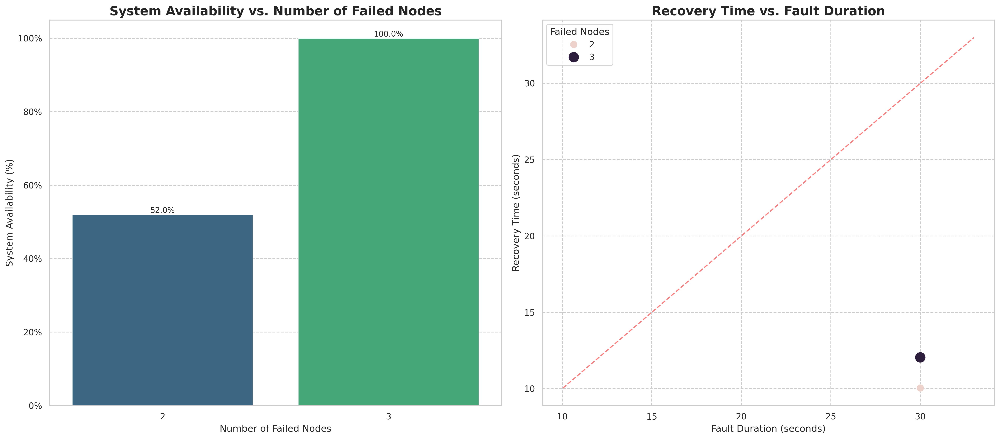

# Blockchain Certificate System: Experiment Analysis
This report summarizes the results of the simulation experiments.

*   Latency data (exp1_latency.csv) not found. Skipping analysis.*

*   Gas cost data (exp1_gas_cost.csv) not found. Skipping analysis.*

*   Throughput data (exp2_throughput.csv) not found. Skipping analysis.*

*   Scalability data (exp3_scalability.csv) not found. Skipping analysis.*

*   Storage cost data (exp4_storage_comparison.csv) not found. Skipping analysis.*

*   Revocation scalability data (exp5_revocation_scalability.csv) not found. Skipping analysis.*

### Experiment 6: Node Fault Recovery Test
This experiment evaluated the system's fault tolerance and recovery capabilities in a distributed environment with multiple nodes. We tested different failure scenarios by shutting down varying numbers of nodes and measuring system availability and recovery time.

| Scenario | Active/Total Nodes | Availability | Successful Txs | Recovery Time (s) | Data Consistent |
|----------|-------------------|-------------|---------------|-----------------|-------------------|
| Double Node Failure | 2/4 | 52.0% | 26/50 | 10.04 | Yes |
| Extreme Failure | 1/4 | 100.0% | 50/50 | 12.05 | Yes |

The results demonstrate the system's resilience to node failures and its ability to recover and maintain data consistency. As expected, system availability decreases as more nodes fail, but the system remains operational even with a significant portion of nodes offline. Recovery times are generally proportional to fault duration, with more complex recovery needed when more nodes have failed.

