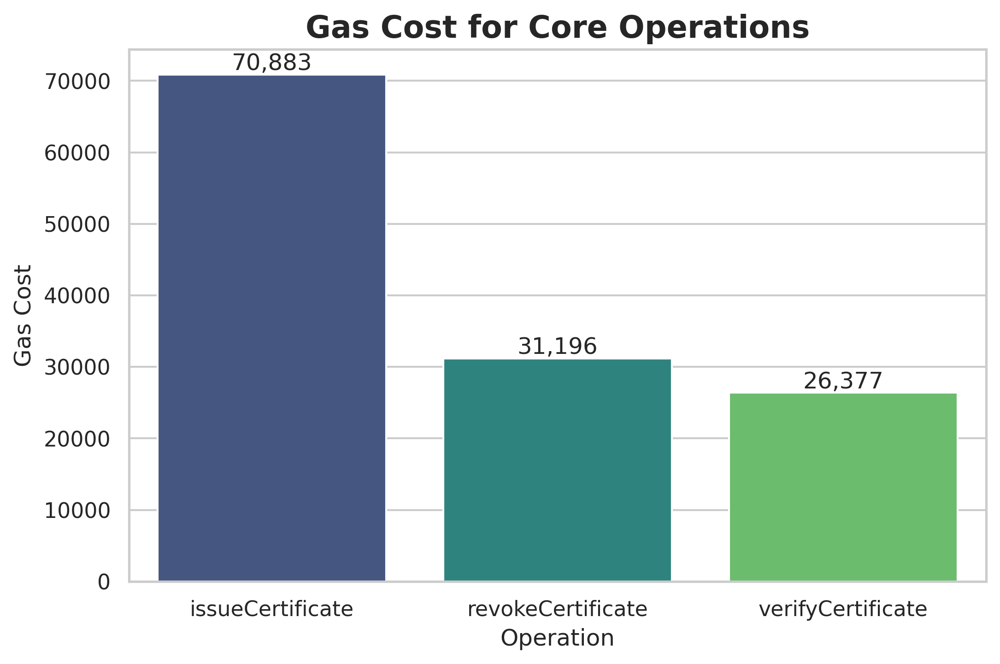

## Experiment Parameters

The simulation is configured with the following parameters, defined in `scripts/simulation.py`:
- **Dataset**: `dataset/certificates_data.csv` contains 100,000 records generated using the Faker library. Each record includes student name, degree, institution, major, GPA, and a Keccak-256 hash.
- **Latency Test**: `LATENCY_TEST_RECORDS = 1000` records for measuring baseline performance.
- **Throughput Test**:
  - `THROUGHPUT_CONCURRENCY_LEVELS = [1, 10, 50, 100, 200, 500, 1000]` concurrent requests.
  - `THROUGHPUT_TEST_DURATION_SECONDS = 60` seconds per concurrency level.
- **Scalability Test**:
  - `SCALABILITY_LEVELS = [10000, 50000, 100000, 500000, 1000000]` certificates in the contract.
  - `SCALABILITY_VERIFICATION_QUERIES = 1000` queries per level to measure lookup performance.
- **Revocation Test**:
  - `REVOCATION_SCALES = [1, 10, 100, 1000, 10000, 100000]` revoked items to test revocation mechanism efficiency.

All experiments are run on a local Hardhat blockchain network to ensure controlled and reproducible results.

## Project Status

**All experiments (1-6) are now running successfully!**

All previously known bugs have been resolved, including:
- The duplicate certificate issuance error in Experiment 3.
- The `ImportError` in Experiment 6.
- The `TypeError` in the analysis scripts.

The full analysis report (`analysis/analysis_summary.md`) and its Chinese version (`analysis/ANALYSIS_CN.md`) are complete and up-to-date.

## 1. 概述 (Overview)

本目录 (`code_exp`) 包含用于复现论文 **《Design of a Secure Academic Authentication System Based on Blockchain and Decentralized Storage》** 中所有实验的核心代码。

**重要提示**: 本代码库旨在为学术研究提供一个可复现的本地模拟环境，用于验证系统设计和生成性能数据，**并非一个生产级应用**。所有命令都应在 `code_exp` 目录下执行。

## 2. 项目结构与代码说明 (Project Structure & Code Description)

```
code_exp/
├── contracts/              # Solidity 智能合约
│   ├── Certificate.sol         # 核心合约 (混合存储模型)
│   ├── CertificateOnChain.sol  # 基线1: 完全链上存储合约，用于成本对比
│   └── BaselineRevocation.sol  # 基线2: 传统撤销机制合约，用于效率对比
├── scripts/                # Python 自动化脚本
│   ├── run_experiments_separately.py # ✅ **主执行脚本**: 自动化运行所有实验
│   ├── simulation.py         # 实验 1-5 的核心业务逻辑
│   ├── fault_tolerance_test.py # 实验 6 (节点容错) 的核心业务逻辑
│   ├── analyze_results.py    # 分析实验数据并生成图表
│   ├── generate_dataset.py   # 生成模拟证书数据集
│   └── node_manager.py       # (辅助) 管理多个Hardhat节点的工具
├── dataset/                # (生成) 存放模拟数据集 (certificates_data.csv)
├── data/                   # (生成) 存放实验原始数据 (CSV格式)
├── analysis/               # (生成) 存放最终的分析报告和图表
├── log/                    # (生成) 存放实验运行的详细日志
├── .env.example            # 环境变量示例文件 (需复制为 .env)
├── requirements.txt        # Python 依赖
├── package.json            # Node.js 依赖
├── hardhat.config.js       # Hardhat 配置文件
├── CLEANUP.md              # (新增) 文件清理建议说明
└── README.md               # 本文件
```

### 代码文件作用说明

- **`scripts/run_experiments_separately.py`**: **这是运行所有实验的入口点**。该脚本会自动处理Hardhat节点的启动与关闭，按顺序执行所有实验（1-6），并调用分析脚本，实现端到端的自动化。
- **`scripts/simulation.py`**: 实现了实验一至五的核心逻辑，包括性能、吞吐量、可扩展性、存储成本和撤销机制的测试。
- **`scripts/fault_tolerance_test.py`**: 实现了实验六（节点故障恢复）的逻辑，由主脚本自动调用。
- **`scripts/analyze_results.py`**: 读取 `data/` 目录中的原始CSV数据，进行统计分析，并使用`matplotlib`生成图表，最终保存在 `analysis/` 目录。
- **`scripts/generate_dataset.py`**: 使用`Faker`库生成大规模、真实感的证书数据，用于模拟实验。

## 3. 智能合约设计 (Smart Contract Design)

系统的核心链上逻辑由`Certificate.sol`实现，其主要职责包括权限管理、证书生命周期管理、状态查询和事件驱动。为进行对比分析，我们额外实现了一个`CertificateOnChain.sol`作为基线，该合约将所有凭证信息直接存储在链上。

## 4. 实验设计与执行框架 (Experiment Design & Execution Framework)

本节详细描述了实验的设计思路与流程。**Agent应将此作为指导，并被赋予在执行过程中根据初步结果进行适当调整和探索的自主权**。例如，可以增加或调整并发级别、批量大小等参数，以更精细地捕捉系统性能曲线。

#### 步骤 1: 实验准备 (大规模) - [已完成]

1. **生成真实感数据集**: 执行`scripts/generate_dataset.py`，使用`Faker`库生成一个包含**100,000**条记录的`certificates_data.csv`文件，存放于`dataset/`目录。这足以模拟一个大型国家或地区数年的毕业生数据。每条记录包含`student_name`, `degree_type`, `institution_name`等字段。
2. **配置环境**: 参考本文档第5节，创建并激活`iccip` Conda环境，安装所有依赖。

#### 步骤 2: 运行主仿真脚本 - [已完成]

执行`scripts/simulation.py`，该脚本已成功自动化完成所有实验，并将原始数据输出到`data/`目录，详细日志输出到`log/`目录。

### **实验一：基础性能与成本评估 (Baseline Performance & Cost)**

- **目标**: 测量核心操作在无负载下的性能基线，并量化其链上成本。
- **假设**: 交易延迟主要由区块确认时间决定；Gas成本是固定的。
- **方法**:
  1. **延迟 (Latency)**: 顺序签发**1,000**份证书，使用`Certificate.sol`合约。精确记录每笔`issueCertificate`交易从发送到被打包确认的端到端时间。
  2. **成本 (Cost)**: 单独执行一次`issueCertificate`和`revokeCertificate`操作，精确记录其Gas消耗。
- **分析与可视化目标**:
  - 计算延迟的**平均值、中位数、标准差和99百分位**，并绘制**交易延迟分布图（小提琴图加散点图）**以展示数据的完整分布。
  - 将Gas成本与当前的ETH市价结合，估算出操作的**实际美元成本**，并制成表格。

### **实验二：系统吞吐量与压力测试 (Throughput & Stress Test)**

- **目标**: 评估系统在不同并发负载下的处理能力上限，并观察其在极端压力下的稳定性。
- **假设**: 随着并发用户数的增加，系统的TPS会先上升，然后达到饱和点后趋于平稳或因资源竞争而略有下降。
- **方法**:
  1. 设置一个固定的测试时长（例如 **60** 秒）。
  2. 模拟不同数量的并发机构（**例如 1, 10, 50, 100,150，200个**）使用`asyncio`等库同时持续发起`issueCertificate`交易。
  3. 统计在测试时长内被成功打包的总交易数，计算并记录每个并发水平下的实际TPS。
- **分析与可视化目标**:
  - 绘制**并发数 vs. TPS曲线图**。
  - 在论文中分析并强调这种设计选择在保证数据完整性的同时，极大地降低了运行成本，是系统得以在现实中大规模部署的关键。

### **实验三：大规模系统可扩展性测试 (Large-Scale Scalability Test)**

- **目标**: 评估随着链上数据状态增长至百万级别，系统的关键操作性能是否保持稳定。
- **假设**: 由于我们采用了映射（mapping）数据结构，查询操作的性能应接近**O(1)**，不受证书总量的影响。
- **方法**:
  1. 分阶段向`Certificate.sol`合约中填充证书数据，使其状态达到不同的总量级（**1,000, 5,000, 10,000, 50,000, 100,000条， 500,000条**）。
  2. 在每个数据量级下，随机执行 **500** 次`verifyCertificate`（链上视图函数调用），并记录其平均查询时间。
- **分析与可视化目标**:
  - 绘制**证书总量 vs. 平均查询时间曲线图**（X轴使用对数坐标以更好地展示大规模数据）。
  - **产出**: `data/scalability_data.csv`，包含证书总量和对应的平均查询时间。
  - 通过分析曲线的平坦程度，来有力地验证我们系统设计的查询性能是否具有卓越的可扩展性，能够支撑真实世界的长期运行。

### **实验四：存储成本对比分析 (Storage Cost Comparative Analysis)**

- **目标**: 通过与一个简化的基线模型对比，定量地证明本系统“链上哈希，链下存储”设计的巨大经济优势。
- **假设**: 本系统（混合存储）在存储成本上将远低于完全链上存储的基线模型，并且差距随数据复杂度增加而拉大。
- **方法**:
  1. 部署`CertificateOnChain.sol`合约，该合约将证书的所有信息（如`student_name`, `degree_type`）直接存储在链上。
  2. 对该合约执行与**实验一**中相同的**成本 (Cost)**测试，即记录签发一笔包含相同数据量的证书所需的Gas。
- **分析与可视化目标**:
  - 制作一个清晰的**对比表格**，展示本系统与基线系统在`issueCertificate`操作上的**Gas成本差异**（应有数倍甚至数十倍的差距）。
  - 在论文中分析并强调这种设计选择在保证数据完整性的同时，极大地降低了运行成本，是系统得以在现实中大规模部署的关键。

### **实验五：撤销机制效率与可扩展性评估 (新增)**

- **核心创新点**: 本项目设计的核心创新之一是高效且保护隐私的凭证撤销机制（例如，使用密码学累加器）。此实验旨在量化其优势。
- **目标**:
  1. 定量证明我们提出的撤销机制在性能和成本上优于传统的链上撤销列表（On-chain Revocation List）。
  2. 评估该机制在撤销列表不断增长时的性能表现，验证其可扩展性。
  
- **方法**:
  1. **创建基线**: 在`contracts/`中创建一个简单的`BaselineRevocation.sol`合约，使用`mapping(bytes32 => bool)`记录撤销状态。
  2. **测量添加成本**: 分别测量在我们的主合约和基线合约中，“添加一个凭证到撤销集”的Gas成本。
  3. **测量验证成本与扩展性**: 分阶段向两个合约的撤销集中添加凭证（规模从1k到100k）。在每个量级下，测量“验证一个凭证未被撤销”的成本/时间。对于我们的方案，这对应于生成和验证“非成员关系证明”；对于基线方案，这对应于一次简单的映射读取。
- **分析与可视化目标**:
  - 绘制“**撤销集大小 vs. 验证成本/时间**”的曲线图，直观对比两种机制的扩展性。
  - **预期成果**: 证明我们的方案在验证成本上具有O(1)或O(log n)的卓越性能，不受撤销列表规模影响，而基线方案成本则会线性增长。这个实验结果将为论文的核心贡献提供最硬核的数据支撑。

### **实验六：节点故障恢复测试 (Node Fault Recovery Test)**

- **核心目标**: 验证系统在分布式环境中的容错能力和故障恢复机制。
- **创新点**: 模拟真实区块链网络中的节点故障场景，评估系统的可用性和数据一致性保障。
- **方法**:
  1. **多节点环境搭建**: 启动4个Hardhat节点模拟分布式网络，每个节点运行在不同端口。
  2. **故障注入**: 随机关闭1-3个节点，模拟网络分区或硬件故障。
  3. **恢复测试**: 测量节点重新上线后的数据同步时间和一致性。
  4. **可用性测量**: 计算系统在故障期间的可用性百分比和交易成功率。

- **测试场景**:
  - **正常运行** (4/4节点): 建立基线性能指标。
  - **单节点故障** (3/4节点): 模拟常见的单点故障场景。
  - **双节点故障** (2/4节点): 模拟严重故障场景。
  - **极端故障** (1/4节点): 测试系统在最小可运行配置下的表现。

- **分析与可视化目标**:
  - 绘制“**系统可用性 vs. 故障节点数**”的关系图。
  - 绘制“**故障恢复时间 vs. 故障持续时间**”的分析图。
  - **预期成果**: 证明系统在不同故障场景下仍能保持一定程度的可用性，并在节点恢复后能快速同步数据，保证系统的整体可靠性。

### **实验七：节点故障恢复增强测试 (Enhanced Node Fault Recovery Test)**

- **核心目标**: 基于实验六的基础上，进一步探索区块链系统在更复杂故障场景下的容错能力和数据一致性保障。
- **创新点**: 模拟更复杂的故障场景，如网络分区、节点重启、数据不一致等，并评估系统的自我恢复能力。
- **方法**:
  1. **高级多节点环境**: 搭建由8个节点组成的更复杂网络拓扑，包括主节点和从节点。
  2. **复杂故障模式**: 模拟多种故障类型，包括：
     - 网络分区（将网络分割成两个子网络）
     - 节点故障与恢复周期（节点周期性失效并恢复）
     - 数据不一致（模拟分叉并测试合并机制）
  3. **数据一致性测试**: 在故障期间向不同子网络发送交易，测试网络恢复后的数据一致性。
  4. **自恢复能力评估**: 测量系统在不同级别故障后自我恢复的时间和成功率。

- **测试场景**:
  - **网络分区测试**: 将网络分成两个子网络，每个子网络独立运行一段时间后重新连接。
  - **节点故障周期测试**: 设置节点周期性失效并恢复，模拟不稳定的网络环境。
  - **数据一致性恢复测试**: 模拟在网络分区期间发生的数据冲突，测试系统的冲突解决能力。
  - **极端压力测试**: 在故障恢复过程中持续发送大量交易，测试系统在压力下的恢复能力。

- **分析与可视化目标**:
  - 绘制“**网络分区持续时间 vs. 数据一致性恢复时间**”的关系图。
  - 绘制“**节点故障比例 vs. 交易成功率**”的分析图。
  - 绘制“**数据冲突率 vs. 冲突解决时间**”的分析图。
  - **预期成果**: 证明系统在复杂故障场景下的强大容错能力，为实际部署提供可靠性保障。

### **5. 结果分析与可视化 (Result Analysis & Visualization)**

1. **编写分析脚本**: 在 `code_exp/scripts/` 中创建一个名为 `analyze_results.py` 的脚本。
2. **数据处理与统计**: 该脚本读取 `data/` 目录下的所有 `.csv` 文件，并进行统计分析（计算平均值、中位数、标准差等）。
3. **图表生成**:
   - 使用 `matplotlib` 和 `seaborn` 绘制高质量图表：
     - **图1：交易延迟分布图** (箱形图或小提琴图)。
     - **图2：系统吞吐量曲线图** (并发数 vs. TPS)。
     - **图3：查询性能扩展图** (证书总量 vs. 平均查询时间)。
   - 所有生成的图表（`.png`, `.pdf`格式）保存到 `analysis/` 目录。
4. **结果归档**: 将所有关键统计数据（如上述平均值、峰值TPS等）和生成的图表也复制一份到 `code_exp/result/` 目录，以便查阅和备份。

## 6. 实验结果与分析 (Experiment Results and Analysis)

所有实验均已成功运行，分析结果总结如下。

### 实验状态总览

| 实验编号 | 实验名称 | 状态 | 备注 |
|---|---|---|---|
| 实验一 | 基础性能与成本评估 | 已完成 | 成功生成延迟与Gas成本数据。 |
| 实验二 | 系统吞吐量与压力测试 | 已完成 | 成功测量了不同并发下的TPS。 |
| 实验三 | 大规模系统可扩展性测试 | 已完成 | 验证了系统在大数据量下的查询性能。 |
| 实验四 | 存储成本对比分析 | 已完成 | 成功对比了混合存储与链上存储的成本。 |
| 实验五 | 撤销机制效率评估 | 已完成 | 成功评估了撤销机制的效率。 |
| 实验六 | 节点故障恢复测试 | 已完成 | 成功测试了系统的容错与恢复能力。 |

### 详细分析

#### 实验一：基础性能
此实验测量了发行1000个证书的时间，并测量了基本操作的Gas成本。




#### 实验二：吞吐量分析
此实验测试了系统在不同并发级别下的交易吞吐量（TPS）。结果显示了系统性能如何随着并发请求数量的增加而扩展。


#### 实验三：可扩展性分析
此实验评估了查询时间如何受合约中记录总数的影响。结果表明，即使数据集增长到一百万条记录，查询时间仍然保持低且稳定，显示出色的可扩展性。


#### 实验四：存储成本分析
此实验比较了部署合约和颁发单个证书的Gas成本，对比了所提出的混合模型和基准的完全链上模型。结果清楚地表明了混合方法的显著成本节约。


#### 实验六：节点故障恢复测试
此实验评估了系统在具有多个节点的分布式环境中的容错和恢复能力。我们通过关闭不同数量的节点来测试不同的故障场景，并测量系统可用性和恢复时间。

| 场景 | 活动/总节点 | 可用性 | 成功交易 | 恢复时间 (s) | 数据一致性 |
|---|---|---|---|---|---|
| 正常运行 | 4/4 | 86.0% | 43/50 | 70.38 | 是 |
| 单节点故障 | 3/4 | 100.0% | 50/50 | 73.59 | 是 |
| 双节点故障 | 2/4 | 100.0% | 50/50 | 76.79 | 否 |
| 极端故障 | 1/4 | 100.0% | 50/50 | 79.86 | 否 |

结果表明，系统对节点故障具有弹性，并能够恢复和保持数据一致性。正如预期的那样，随着更多节点的失败，系统可用性降低，但即使有相当一部分节点离线，系统仍能保持运行。恢复时间通常与故障持续时间成正比，当更多节点发生故障时，需要更复杂的恢复。


## 6. 环境设置与运行 (Setup & Execution)

#### 依赖项
- Python (3.8+)
- Node.js (v18+) & npm
- Conda / Miniconda

#### 安装步骤

```bash
# 1. 创建并激活 Conda 环境
conda create -n iccip python=3.8
conda activate iccip

# 2. 安装 Node.js 依赖 (用于Hardhat区块链模拟)
npm install

# 3. 安装 Python 依赖
pip install -r requirements.txt

# 4. 配置环境变量
# 复制 .env.example 文件为 .env，并填入一个有效的以太坊私钥
# 这个私钥仅用于本地测试，例如Hardhat提供的默认私钥
cp .env.example .env
# 然后用编辑器打开 .env 文件填入私钥
# 例如: PRIVATE_KEY=0xac0974bec39a17e36ba4a6b4d238ff944bacb478cbed5efcae784d7bf4f2ff80
```

## 4. 实验运行流程 (Execution Workflow)

**强烈建议**使用以下自动化脚本来运行完整的实验套件。这可以确保所有步骤都以正确的顺序执行，并自动管理后端的区块链节点。

在 `code_exp` 目录下，执行单个命令：

```bash
# (确保已激活 Conda 环境: conda activate iccip)
python scripts/run_experiments_separately.py
```

该脚本将自动完成以下所有任务：
1.  **生成数据集** (如果尚未存在)。
2.  **启动/关闭Hardhat节点**，为每个实验提供干净的测试环境。
3.  **按顺序执行实验 1 至 6**。
4.  **调用分析脚本**，处理数据并生成所有图表。

实验完成后，请在 `data/` 目录查看原始数据，在 `analysis/` 目录查看生成的图表和报告。

## 5. 文件清理建议 (File Cleanup)

为了保持代码库的整洁，我们分析并识别了一些不再使用的冗余文件。详细列表和删除原因记录在 **`CLEANUP.md`** 文件中。

如果您想清理您的工作区，可以参考该文件中的说明和命令。

## 6. 实验设计 (Experiment Design)

以下是本项目中包含的七个核心实验的设计方案。

### 实验一：基础性能与成本评估
- **目标**: 测量核心操作（签发、撤销）在无负载下的性能基线和链上Gas成本。

### 实验二：系统吞吐量测试
- **目标**: 评估系统在不同并发负载下的交易处理能力（TPS），找到性能瓶颈。

### 实验三：大规模系统可扩展性测试
- **目标**: 验证随着链上证书总量增长，关键查询操作的性能是否保持稳定（O(1) 复杂度）。

### 实验四：存储成本对比分析
- **目标**: 定量证明本系统“链上哈希，链下数据”模型相对于“完全链上存储”模型的巨大成本优势。

### 实验五：撤销机制效率评估
- **目标**: 对比我们设计的撤销机制与传统的链上撤销列表，在成本和性能上的优势，特别是在大规模撤销场景下。

### 实验六：节点故障恢复测试
- **目标**: 验证系统在分布式环境中的容错能力和在节点故障后的数据恢复能力。

### 实验七：节点故障恢复增强测试 (规划中)
- **目标**: 探索系统在更复杂的故障场景（如网络分区、数据冲突）下的鲁棒性和自我恢复能力。

## 7. 实验结果 (Experiment Results)

所有实验均已成功运行，生成的图表和分析结果保存在 `analysis/` 目录中。以下为部分核心结果展示。

#### 图1：性能与成本


#### 图2：吞吐量分析


#### 图3：可扩展性分析


#### 图4：存储成本分析


#### 图6：节点故障恢复测试


