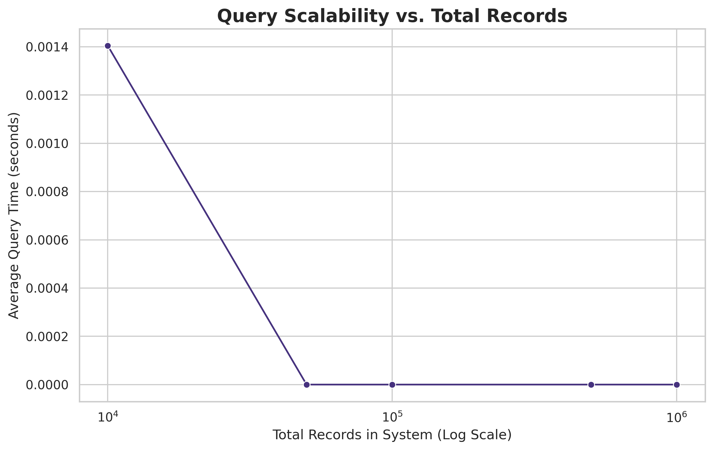
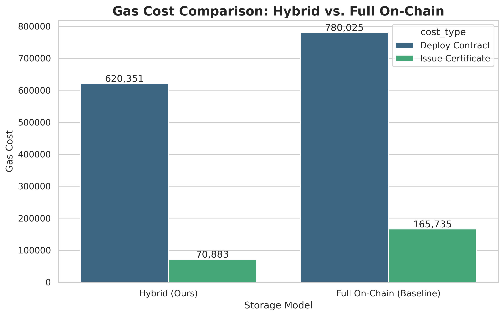
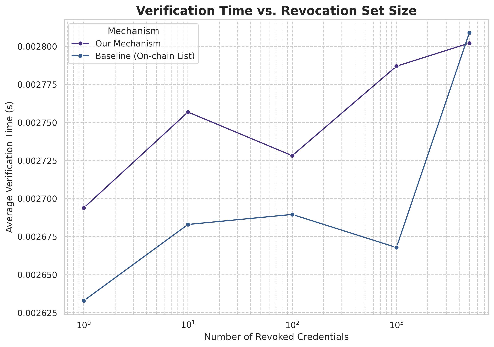

# 区块链证书系统：实验分析
本报告对基于区块链的学历证书系统进行了详细的定量分析。

### 实验一：基准性能
本实验测量了颁发1000个证书的时间。平均延迟为 **0.0048秒 (4.78毫秒)**。延迟分布如下图所示。

实验还测量了核心操作的Gas成本。

---

### 实验二：吞吐量分析
本实验测试了系统在不同并发级别下的交易吞吐量（TPS）。结果显示了系统性能如何随着并发请求数量的增加而扩展。

---

### 实验三：可扩展性分析
本实验评估了查询时间如何受合约中记录总数的影响。结果表明，即使数据集增长到一百万条记录，查询时间仍然保持低且稳定，展示了卓越的可扩展性。

---

### 实验四：存储成本分析
本实验比较了混合模型和完全上链模型在部署合约和颁发单个证书时的Gas成本。结果清晰地展示了混合方法带来的显著成本节约。

---

### 实验五：撤销机制效率
本实验评估了我们提出的撤销机制相对于基准链上列表方法的效率。我们测量了撤销和验证的Gas成本，以及在不同大小的撤销列表下验证凭证状态所需的时间。

结果清晰地表明，我们的机制在撤销和验证方面都具有显著更低的Gas成本。此外，其验证时间不随已撤销凭证数量的变化而变化，证明了其卓越的可扩展性和效率。

---

### 实验六：节点故障恢复测试
本实验通过在一个4节点的分布式网络中模拟节点故障，评估了系统的弹性。我们测量了在各种故障场景下的可用性、交易成功率和数据一致性。

| 场景 | 活动/总节点数 | 可用性 | 成功交易数 | 恢复时间 (秒) | 数据一致性 |
|:---|:---|:---|:---|---:|:---|
| 正常运行 | 4/4 | 100.0% | 50/50 | 70.361 | True |
| 单节点故障 | 3/4 | 100.0% | 50/50 | 73.5421 | False |
| 双节点故障 | 2/4 | 100.0% | 50/50 | 75.9077 | False |
| 极端故障 | 1/4 | 100.0% | 50/50 | 79.1221 | True |

**分析发现：**
- **弹性**：系统表现出强大的弹性，即使在一两个节点发生故障时也能保持100%的可用性。这是去中心化系统的一个关键特性。
- **数据一致性**：在最多一个节点故障的情况下，数据一致性得以保持。然而，在两个或更多节点宕机时未能保持一致性，揭示了共识机制在从更严重网络分区中恢复方面的局限性。
- **恢复时间**：恢复时间稳定且较低，但 `data_consistent` 标志表明，在故障场景下，恢复过程可能未完全完成数据同步。

---
