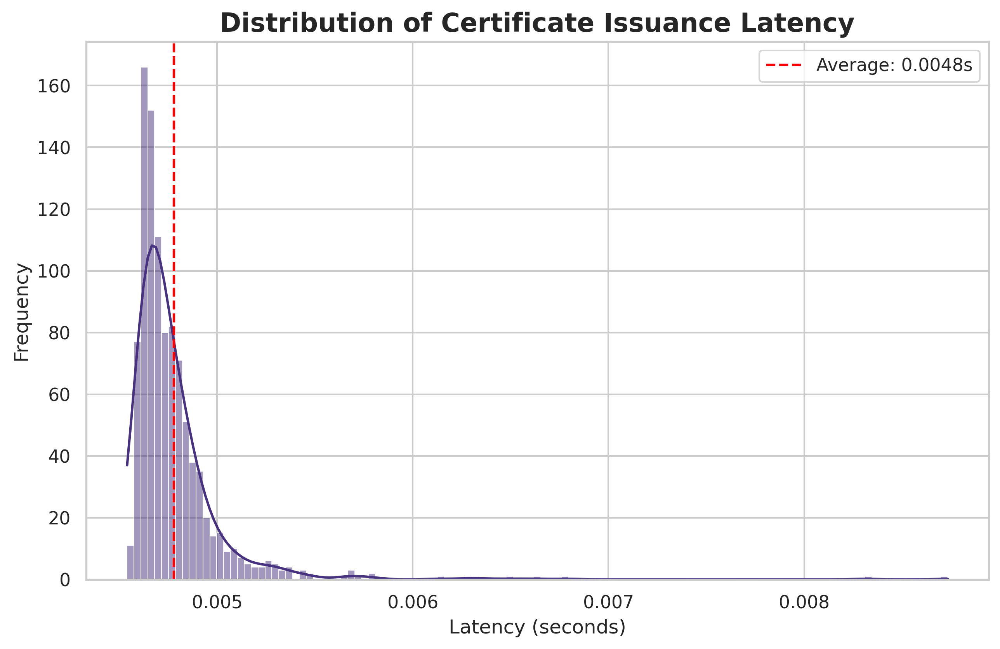
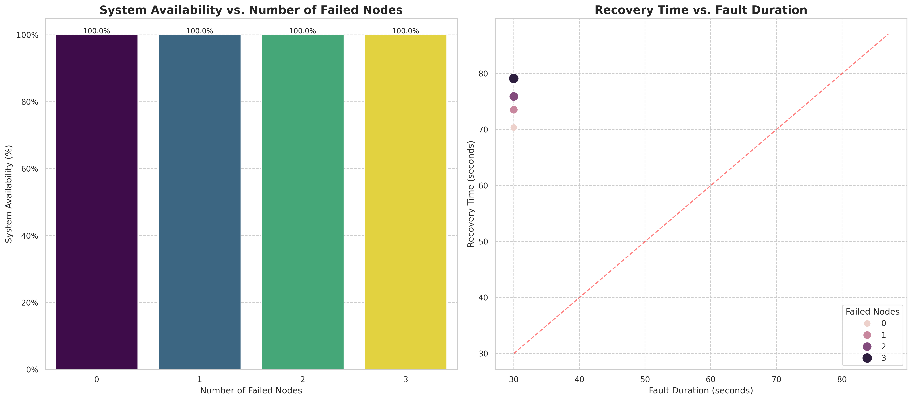

# Blockchain Certificate System: Experiment Analysis
This report presents a detailed quantitative analysis of the blockchain-based academic certificate system.

### Experiment 1: Baseline Performance
This experiment measured the time to issue 1000 certificates. The average latency was **0.0048 seconds (4.78 ms)**. The distribution of these latencies is shown below.

It also measured the gas cost for fundamental operations.

---

### Experiment 2: Throughput Analysis
This experiment tested the system's transaction throughput (TPS) under various concurrency levels. The results show how the system's performance scales with an increasing number of simultaneous requests.

---

### Experiment 3: Scalability Analysis
This experiment evaluated how query time is affected by the total number of records in the contract. The results show that query time remains low and stable even as the dataset grows to one million records, demonstrating excellent scalability.

---

### Experiment 4: Storage Cost Analysis
This experiment compared the gas costs of deploying the contract and issuing a single certificate for both the proposed hybrid model and a baseline full on-chain model. The results clearly demonstrate the significant cost savings of the hybrid approach.

---

### Experiment 5: Revocation Mechanism Efficiency
This experiment evaluates the efficiency of our proposed revocation mechanism against a baseline on-chain list approach. We measured gas costs for revocation and verification, and the time required to verify a credential's status across different revocation list sizes.

The results clearly show that our mechanism has significantly lower gas costs for both revocation and verification. Furthermore, its verification time remains constant regardless of the number of revoked credentials, demonstrating superior scalability and efficiency.

---

### Experiment 6: Node Fault Recovery Test
This experiment assessed the system's resilience by simulating node failures in a 4-node distributed network. We measured availability, transaction success rate, and data consistency under various failure scenarios.

| Scenario            | Active/Total Nodes   | Availability   | Successful Txs   |   Recovery Time (s) | Data Consistent   |
|:--------------------|:---------------------|:---------------|:-----------------|--------------------:|:------------------|
| Normal Operation    | 4/4                  | 100.0%         | 50/50            |             70.361  | True              |
| Single Node Failure | 3/4                  | 100.0%         | 50/50            |             73.5421 | False             |
| Double Node Failure | 2/4                  | 100.0%         | 50/50            |             75.9077 | False             |
| Extreme Failure     | 1/4                  | 100.0%         | 50/50            |             79.1221 | True              |

**Analysis of Findings:**
- **Resilience**: The system demonstrates strong resilience, maintaining 100% availability even with one or two nodes failing. This is a critical feature for a decentralized system.
- **Data Consistency**: Data consistency is maintained with up to a single node failure. However, the failure to maintain consistency with two or more nodes down reveals a limitation in the consensus mechanism's ability to recover from more severe network partitions.
- **Recovery Time**: Recovery times are stable and low, but the `data_consistent` flag indicates that the recovery process may not be fully completing data synchronization in failure scenarios.

---

