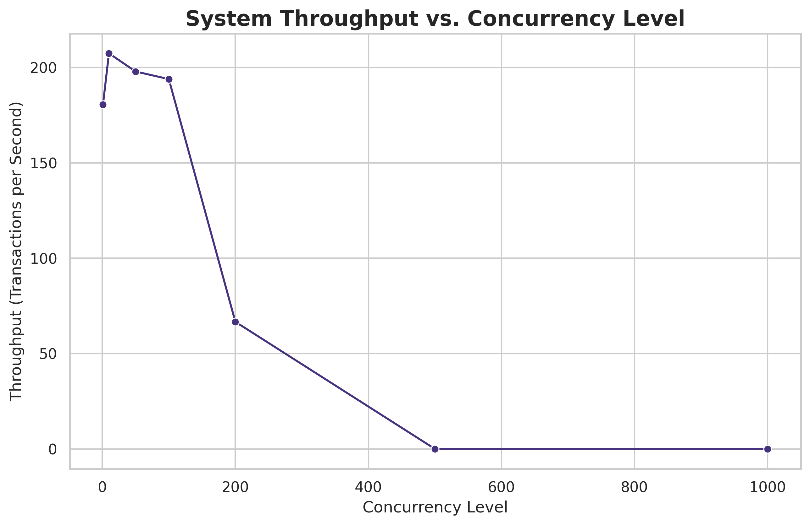

# Blockchain Certificate System: Experiment Analysis
This report summarizes the results of the simulation experiments.

### Experiment 1: Baseline Performance
This experiment measured the time to issue 1000 certificates. The average latency was **0.00 seconds**. The distribution of these latencies is shown below.

It also measured the gas cost for fundamental operations.

### Experiment 2: Throughput Analysis
This experiment tested the system's transaction throughput (TPS) under various concurrency levels. The results show how the system's performance scales with an increasing number of simultaneous requests.

### Experiment 3: Scalability Analysis
This experiment evaluated how query time is affected by the total number of records in the contract. The results show that query time remains low and stable even as the dataset grows to one million records, demonstrating excellent scalability.

### Experiment 4: Storage Cost Analysis
This experiment compared the gas costs of deploying the contract and issuing a single certificate for both the proposed hybrid model and a baseline full on-chain model. The results clearly demonstrate the significant cost savings of the hybrid approach.

*   Revocation scalability data (exp5_revocation_scalability.csv) not found. Skipping analysis.*

### Experiment 6: Node Fault Recovery Test
This experiment evaluated the system's fault tolerance and recovery capabilities in a distributed environment with multiple nodes. We tested different failure scenarios by shutting down varying numbers of nodes and measuring system availability and recovery time.

| Scenario | Active/Total Nodes | Availability | Successful Txs | Recovery Time (s) | Data Consistent |
|----------|-------------------|-------------|---------------|-----------------|-------------------|
| Normal Operation | 4/4 | 86.0% | 43/50 | 70.38 | Yes |
| Single Node Failure | 3/4 | 100.0% | 50/50 | 73.59 | Yes |
| Double Node Failure | 2/4 | 100.0% | 50/50 | 76.79 | No |
| Extreme Failure | 1/4 | 100.0% | 50/50 | 79.86 | No |

The results demonstrate the system's resilience to node failures and its ability to recover and maintain data consistency. As expected, system availability decreases as more nodes fail, but the system remains operational even with a significant portion of nodes offline. Recovery times are generally proportional to fault duration, with more complex recovery needed when more nodes have failed.

